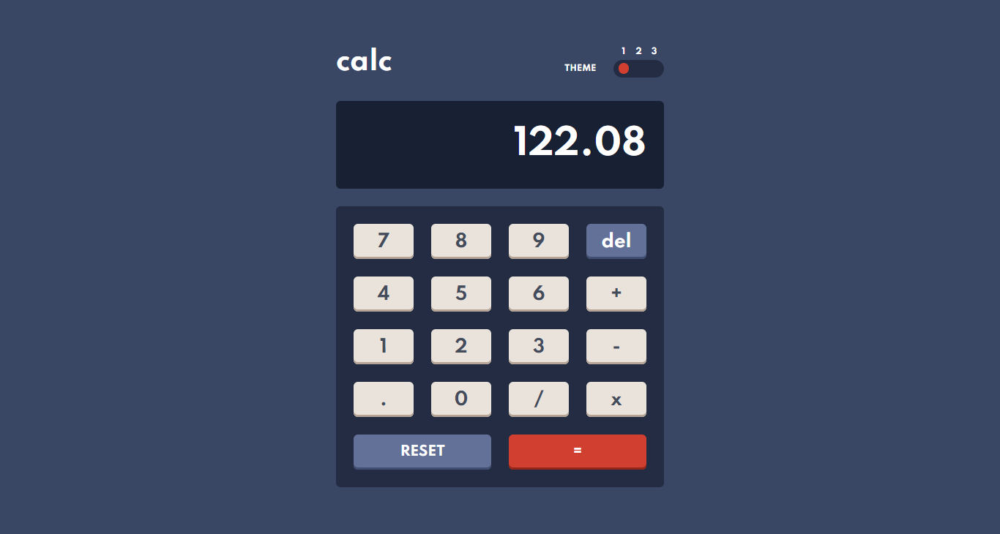
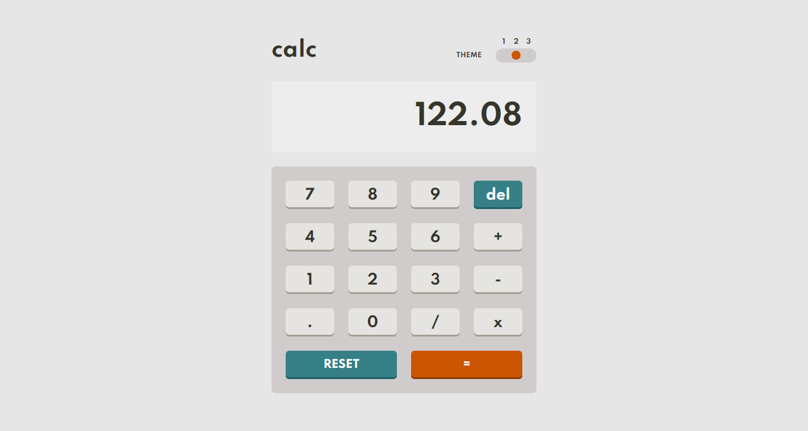
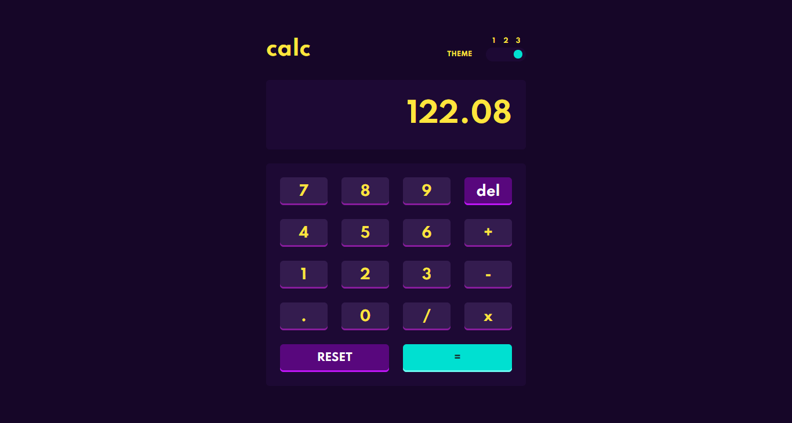
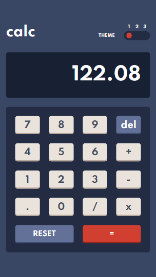
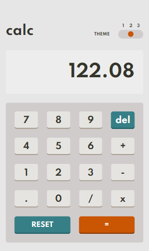
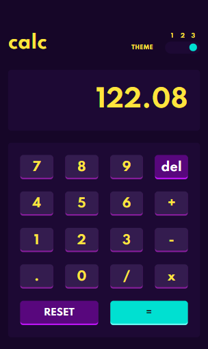

# Frontend Mentor - Calculator app

Live Solution [Here](https://calculator-app-vanilla-js.vercel.app/).

## Desktop Design

### Theme 1

### Theme 2

### Theme 3

## Mobile Design

### Theme 1

### Theme 2

### Theme 3

 

[Frontend Mentor](https://www.frontendmentor.io) challenges allow you to improve your skills in a real-life workflow.
